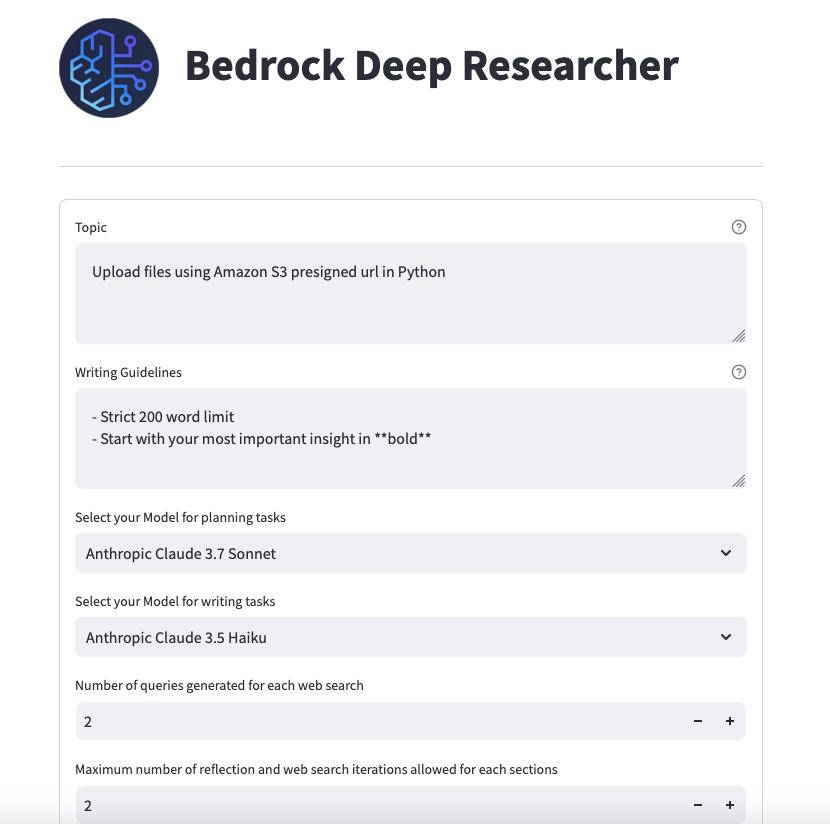
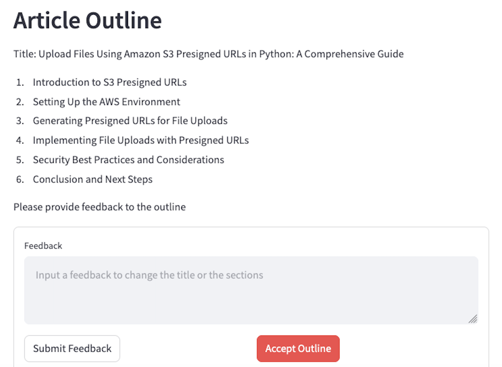

# AI-Powered Article Generation with Bedrock Deep Research

Bedrock Deep Research is a Streamlit-based application using Amazon Bedrock, LangGraph, and LangChain AWS libraries that automates article/report generation through AI-powered research, content writing, and image generation. It combines web research, structured content generation, and human feedback to produce comprehensive, well-researched articles with accompanying header images (generated by [Amazon Bedrock Nova Canvas](https://docs.aws.amazon.com/nova/latest/userguide/what-is-nova.html)). This repo is inspired by LangChain's [Deep Researcher](https://github.com/langchain-ai/open_deep_research/tree/main).

## Features
- **Automated Research**: Performs targeted web searches to gather relevant information
- **Structured Content Generation**: Creates cohesive article outlines and detailed section content
- **Interactive Feedback Loop**: Incorporates human feedback to refine article outlines
- **AI-Generated Imagery**: Produces relevant header images for visual appeal

### Repository Structure
```
bedrock_deep_research/
├── bedrock_deep_research.py          # Main Streamlit application entry point
├── bedrock_deep_research/
│   ├── config.py             # Configuration settings and parameters
│   ├── graph.py              # Core workflow orchestration using LangGraph
│   ├── model.py              # Data models for articles and sections
│   ├── nodes/                # Individual workflow components
│   │   ├── article_head_image_generator.py    # Header image generation
│   │   ├── article_outline_generator.py       # Article outline creation
│   │   ├── section_writer.py                  # Section content generation
│   │   └── [other node files]                 # Additional workflow components
│   ├── utils.py              # Utility functions
│   └── web_search.py         # Web research integration using Tavily API
├── poetry.lock               # Poetry dependency lock file
└── pyproject.toml           # Project configuration and dependencies
```


## Work Flow
The application follows a sequential workflow from topic input to final article generation, with feedback loops for refinement.


Key Components of the graph:
1. **Initial Researcher**: It performs initial web searches to gather context
2. **Article Outline Generator**: creates structured outline using research data
   - **Human Feedback Provider**: This incorporates human feedback for the outline
3. **Section Writer**: A subgraph that generates content after web research.
4. **Compilation**: combines all elements into a cohesive article
5. **Final Section Generation**: Generate the overview and the last paragraph based on the other sections.
6. **Header Image Generator**: creates relevant header image


# Setup

The setup is meant to be used locally with [AWS authentication](https://docs.aws.amazon.com/cli/v1/userguide/cli-authentication-short-term.html), as well as within Amazon Sagemaker: either in [JupyterLab](https://docs.aws.amazon.com/sagemaker/latest/dg/studio-updated-jl.html) or [Code Editor](https://docs.aws.amazon.com/sagemaker/latest/dg/code-editor.html) instance.

Note: Current setup is assuming `us-east-1` region (as defined in `env.tmp` file).


## Prerequisites
- **Python 3.12** (to install, visit this link: https://www.python.org/downloads/).
   Check your python version using `python --version`.
   If your global python isn't set as `3.12`, follow the steps here: https://python-poetry.org/docs/managing-environments/)
- **Poetry** for dependency management
- Make sure you have **enabled model access** via [AWS Bedrock access](https://docs.aws.amazon.com/bedrock/latest/userguide/model-access-modify.html) in **`us-east-1`** region. You can find the supported models provided in `SUPPORTED_MODELS` variable in `./bedrock_deep_research/config.py`.
- **Tavily API** key for web research capabilities.


### 1. Installation
```bash
# Clone the repository
git clone https://github.com/aws-samples/sample-bedrock-deep-researcher.git
cd sample-bedrock-deep-researcher

# Activate the virtual environment
poetry shell

# Install dependencies using Poetry
poetry install
```

### 2. Create and set your Tavily API key

Go to https://app.tavily.com/home and create a free API KEY. Copy the API Key and paste it into the `env.tmp` file.

### 3. Setup the environment variables

Copy the environment variables into the local environment.
```
cp env.tmp .env
```

### 4. Run the application

- Start the Streamlit application:
```bash
streamlit run bedrock_deep_research.py
```

## Using the Application


| Step | Description | Visual Reference |
|------|-------------|------------------|
| **1. Enter Article Details** | • Enter your article topic in the main input field<br>• Add specific writing guidelines in the text area provided<br>• Adjust search parameters using the configuration panel<br>• Click the "Generate Outline" button to start the process |  |
| **2. Review and Refine the Outline** | • Review the AI-generated article outline<br>• Provide specific feedback in the feedback field to improve the structure<br>• Use the editing tools to make direct modifications if needed<br>• Click "Accept Outline" when you're satisfied with the structure |  |
| **3. Generate the Complete Article** | • Review the fully researched and written article with its custom header image<br>• Use the formatting tools to make any final adjustments<br>• Click "Copy to Clipboard" to export your article<br>• Or select "New Article" to start the process again |  |


### Configuration details

**Writing Guideline samples:**
You could include instructions like:
```text
- Strict 150-200 word limit
- Start with your most important insight in **bold**
- Include code examples where relevant
- Focus on practical implementation
```

**Web Research Configuration:**
```python
number_of_queries = 2  # Number of search queries per section
max_search_depth = 2   # Maximum research iterations per section
```

**Debug Mode:**
```bash
# Enable debug logging
export LOG_LEVEL=DEBUG
streamlit run bedrock_deep_research.py
```


### Contributing
Contributions are welcome! Please open an issue or submit a pull request if you have any improvements or bug fixes. Read CONTRIBUTING.md for more details.


### License
This library is licensed under the MIT-0 License. See the LICENSE file.
